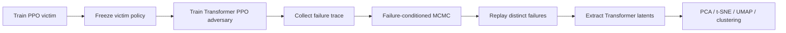
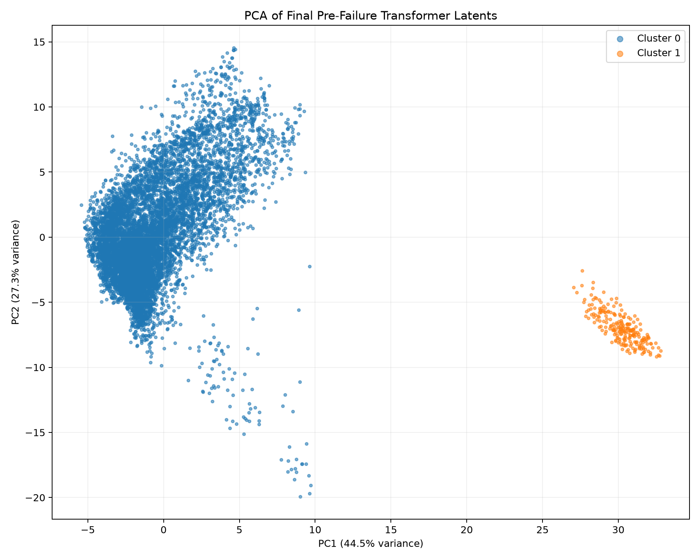
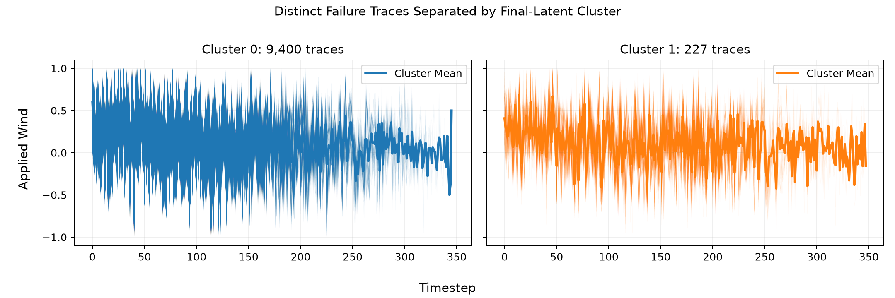

# Adversarial Transformer PPO for CartPole

[](https://github.com/soreng25/Adversarial-Transformer-PPO-agent-in-Cartpole/actions/workflows/tests.yml)
[](https://www.python.org/)
[](LICENSE)

An adversarial reinforcement-learning pipeline for discovering plausible failure modes in a frozen CartPole controller. A Transformer PPO adversary applies bounded wind disturbances, failure-conditioned MCMC explores the resulting rare-event region, and latent-space analysis reveals distinct pre-failure behaviors.

## Highlights

- Trains a nominal PPO victim and a memory-enabled GTrXL PPO adversary with Ray RLlib.
- Penalizes unlikely disturbances instead of rewarding unconstrained attacks.
- Samples only failure-causing wind histories with random-walk Metropolis MCMC.
- Replays distinct chain states to extract 64-dimensional pre-failure Transformer representations.
- Includes constant-wind, random-wind, and sinusoidal robustness baselines.
- Covers the numerical and analysis pipeline with 43 deterministic unit tests.

## Pipeline



The adversary changes the environment dynamics, not the victim's observations, actions, or parameters. Its action is a bounded continuous wind force added to the victim's discrete control force.

## Verified results

The primary archived MCMC run records 100,000 proposals at proposal standard deviation `0.01`:

| Metric | Result |
| --- | ---: |
| Accepted proposals | 9,626 / 100,000 (9.626%) |
| Proposals that still caused failure | 12.352% |
| Out-of-bounds proposals | 2.972% |
| Distinct failure states | 9,627 |
| Median failure step across chain rows | 130 |

K-means selected two clusters in the standardized 64-dimensional final-latent space. The dominant cluster contained 9,400 distinct traces with median failure step 120; the smaller cluster contained 227 traces with median failure step 233. These are descriptive failure modes—not evidence that the latent clusters cause failure.

<p align="center">
  
</p>

<p align="center">
  
</p>

The pure phase-zero sinusoidal baseline at frequency `0.23` did not cause failure for amplitudes `0.1` through `1.0` on the discovery seed. This indicates that the observed Fourier peak alone is insufficient to reproduce the sampled failures.

See [methodology](docs/methodology.md) for the objective and sampler, and [results](docs/results.md) for diagnostics, sensitivity analysis, and limitations.

## Installation

The actively supported environment is Python 3.11 with Ray RLlib 2.40.

```bash
python -m venv .venv
python -m pip install --upgrade pip
pip install -r requirements.txt
```

For the executed analysis notebook, install the additional notebook dependencies:

```bash
pip install -r requirements-analysis.txt
jupyter lab notebooks/mcmc_analysis.ipynb
```

## Quick start

Train and save the frozen victim:

```bash
python train_victim.py --iters 100 --out-dir checkpoints/victim
```

Train the Transformer adversary and record evaluation traces:

```bash
python train_adversary.py \
  --victim-checkpoint checkpoints/victim \
  --iters 100 \
  --max-wind 1.0 \
  --wind-history-out adversary_wind_history_same_seeds.npz \
  --out-dir checkpoints/adversary
```

Start a failure-conditioned MCMC chain from a recorded failed episode:

```bash
python mcmc_failure_trace.py \
  --input adversary_wind_history_same_seeds.npz \
  --episode-index 6 \
  --victim-checkpoint checkpoints/victim \
  --iterations 100000 \
  --output episode_6_mcmc.npz
```

Plot the chain and run the baseline evaluations:

```bash
python plot_wind_history.py --input episode_6_mcmc.npz --burn-in 1000 --thin 10 --show-mean --out-path episode_6_mcmc.png
python eval_constant_wind.py --victim-checkpoint checkpoints/victim
python eval_sine_wind.py --victim-checkpoint checkpoints/victim
```

Run the complete unit-test suite:

```bash
python -m unittest discover -s tests -v
```

The victim observation model must remain consistent across training, adversary evaluation, and replay. Use `--env stateless` for victim training and `--victim-env stateless` in downstream commands when working with the partially observable variant.

## Reproducing the archived analysis

The large arrays and model checkpoints are intentionally stored outside the source tree. Download `adversarial-cartpole-artifacts-v1.0.0.zip` from the [v1.0.0 release](https://github.com/soreng25/Adversarial-Transformer-PPO-agent-in-Cartpole/releases/tag/v1.0.0), verify it against the attached SHA-256 file, and extract it into a separate trusted directory.

The archived policy checkpoints were produced with **Python 3.8 and Ray 2.10.0**. Exact latent extraction enforces that legacy runtime because RLlib checkpoints are version-sensitive. The precomputed NPZ results and executed notebook can be inspected with the supported Python 3.11 analysis environment. Only load pickle-based checkpoints from a source you trust.

## Repository layout

```text
envs/                         Custom adversarial and history environments
tests/                        Deterministic unit tests
notebooks/                    Curated executed analysis notebook
docs/                         Methodology, results, and selected figures
train_victim.py               Nominal PPO training and evaluation
train_adversary.py            Transformer adversary training and evaluation
mcmc_failure_trace.py         Failure-conditioned Metropolis sampler
extract_transformer_latents.py Replay and latent extraction
analyze_transformer_latents.py Clustering and dimensionality reduction
eval_*.py                     Robustness baselines
plot_*.py                     Trace and survival visualizations
```

## Responsible interpretation

This is a controlled CartPole robustness study, not evidence about real autonomous systems. Results use one environment family, a deterministic frozen victim, a hand-specified Gaussian disturbance model, and failure-conditioned samples from one seeded experiment. MCMC mixing and sensitivity to the proposal distribution must be evaluated before treating the samples as representative.

## License

Released under the [MIT License](LICENSE).
