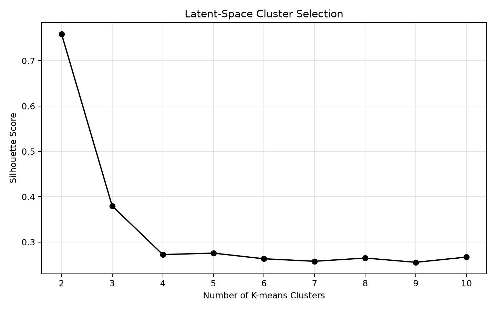

# Results and diagnostics

## Primary MCMC run

Stored metadata—not filenames—is treated as the source of truth. The primary archive contains 100,000 proposals with proposal standard deviation `0.01`.

| Diagnostic | Value |
| --- | ---: |
| Acceptance rate | 9.626% |
| Proposal failure rate | 12.352% |
| Out-of-bounds rate | 2.972% |
| Distinct visited failure states | 9,627 |
| Mean failure step across chain rows | 141.85 |
| Median failure step across chain rows | 130 |

## Proposal-scale sensitivity

Increasing the proposal standard deviation from `0.01` to `0.05` reduced acceptance from 9.626% to 0.751% and increased the out-of-bounds rate from 2.972% to 21.03%. The larger step size produced only 752 distinct visited states in 100,000 proposals, demonstrating why proposal scale is a computational tuning parameter rather than part of the natural-wind model.

## Final-latent clusters

K-means selected `k=2` using random seed 42.

| Cluster | Distinct traces | Prevalence | Mean failure step | Median failure step |
| --- | ---: | ---: | ---: | ---: |
| 0 | 9,400 | 97.64% | 130.82 | 120 |
| 1 | 227 | 2.36% | 236.95 | 233 |

The first two PCA components explain 44.49% and 27.33% of standardized latent variance. The smaller cluster is separated in the low-dimensional views and associated with later failures.

## Interpretation limits

- Both clusters contain failures; the analysis has no successful-trajectory comparison group.
- Clusters describe internal representations and do not establish causal failure mechanisms.
- Results come from a single victim/adversary checkpoint pair and seeded MCMC experiment.
- The independent Gaussian wind prior is a modeling assumption, not an empirical weather model.
- Thinning reduces plotting and storage density but cannot repair poor chain mixing.
